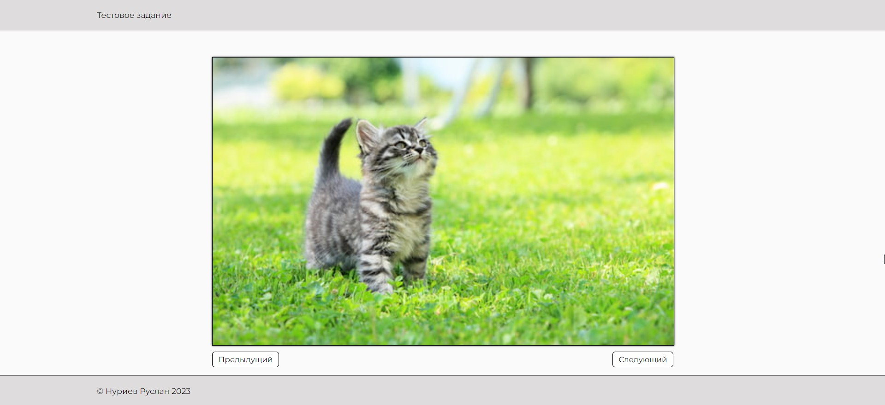
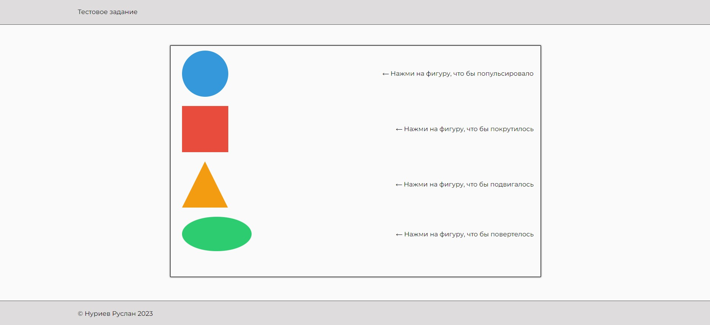
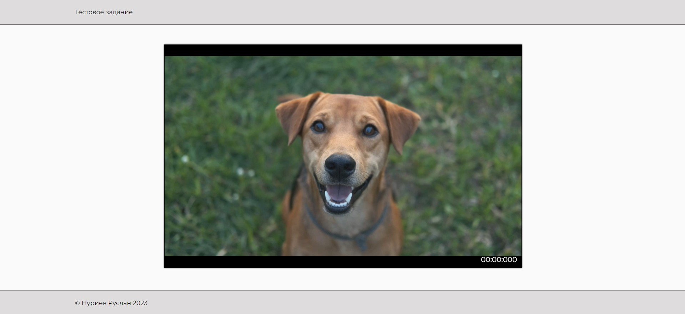
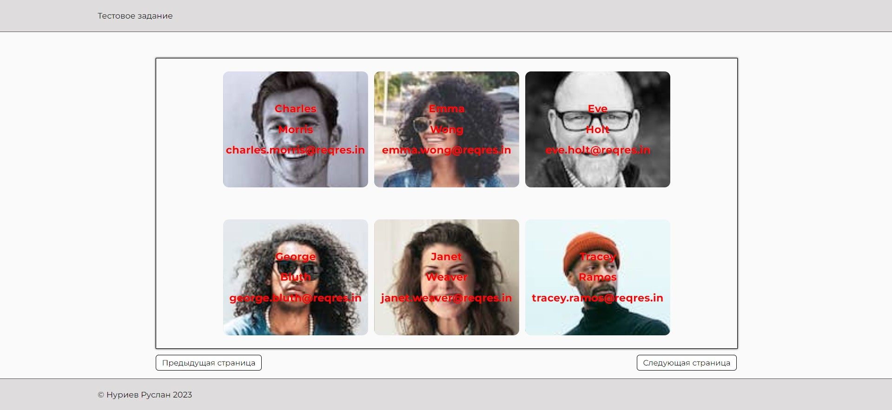
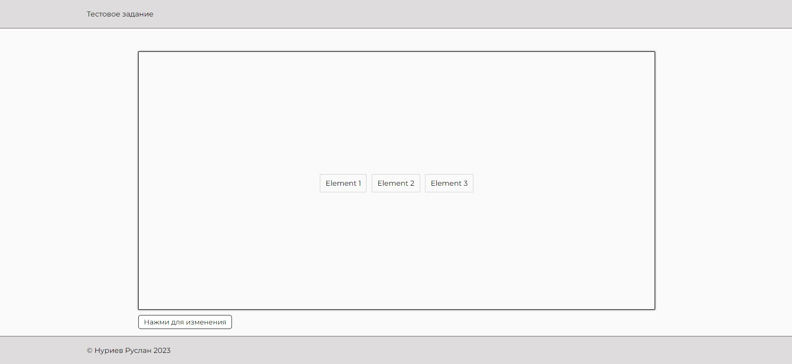
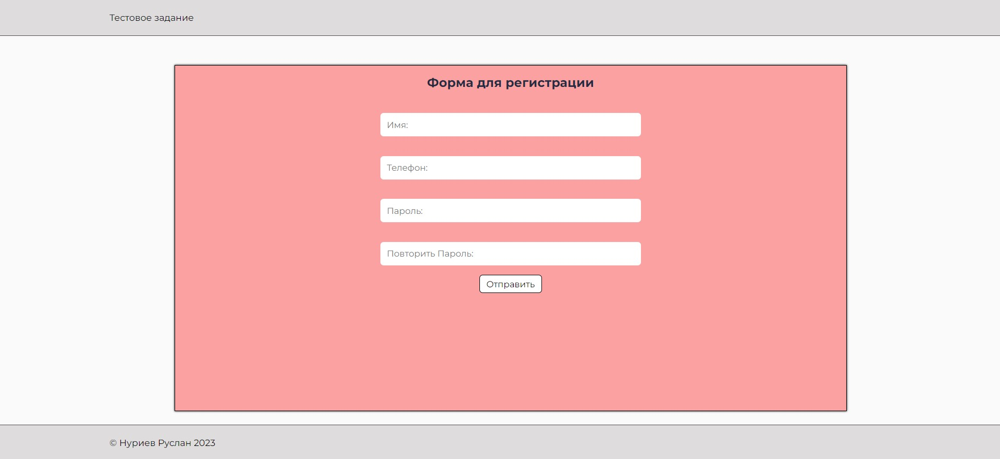
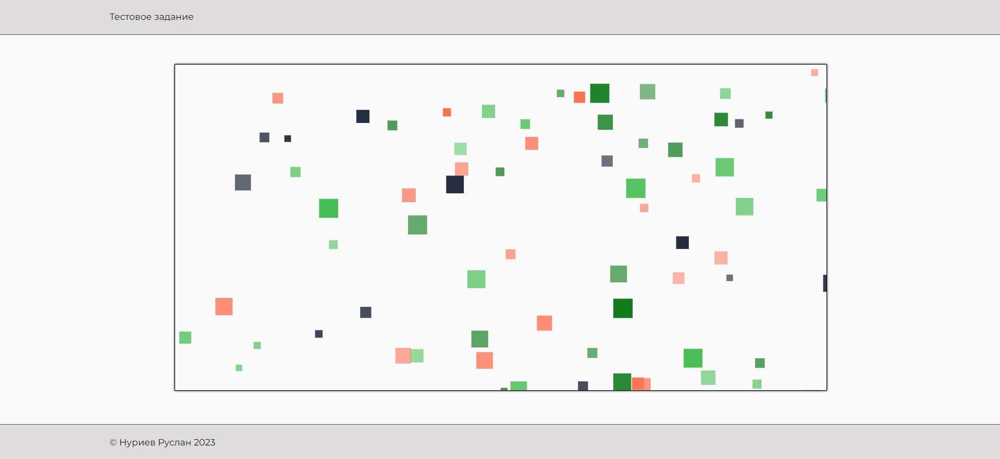

# Отработка тестовых заданий

## Screenshots:
 | 
--- | ---
 | 
--- | ---
 | 
--- | ---

## Задания:
- Реализуйте простой слайдер с помощью класса JavaScript, при создании экземпляра объекта конструктор как минимум должен принимать массив ссылок на картинки слайдов.

- Сверстайте основные геометрические фигуры(окружность, треугольник, квадрат, прямоугольник) и задайте разные анимации с помощью keyframes, запуск по клику. ( Пульсация, перемещение, вращение, 3D-трансформации или другие на своё усмотрение). Плюсом будет дополнительная реализация на canvas. 

- Реализовать воспроизведение видеофайла (желательно формата webm). Никаких элементов управления на блоке быть не должно, только предзагруженный первый кадр видео и текущее время видео в формате MM:SS:mmm. Видео должно запускаться и ставиться на паузу по клику мыши. По окончанию видео останавливается и возвращается на начальный кадр;

- Реализуйте получение JSON данных с помощью HTTP запроса, проверку данных на корректность, отсортируйте объекты пользователей по имени в алфавитном порядке и вывести все данные пользователя в отдельные карточки на страницу, реализовать постраничную пагинацию или подзагрузку.

- Создать элемент на странице. При клике на который будут открываться 3 любых
элемента на странице в течении 1 секунды. И при повторном клике 3 элемента будут
закрываться. Необходимо использовать дебаунс.

- Сверстать форму с полями - имя, телефон, пароль, повтор пароля и реализовать функцию валидации данных при нажатии кнопки отправки. В случае ошибки выводить сообщение.
Имя - только кириллица/латиница, от 3 до 30 символов.
Телефон - от 10 до 15 символов, состоит из цифр, может начинаться с плюса.
Пароль -  от 8 до 40 символов, обязательно хотя бы одна заглавная буква и цифра, пароли должны совпадать. 

- С помощью цикла вывести случайное количество (от 10 до 100 ) разноцветных
квадратиков на HTML страницу. 

### Требования:
- Каждое задание должно быть в отдельной директории
- На фронтенде использовать только чистый javascript без библиотек
- Использование БЭМ.

